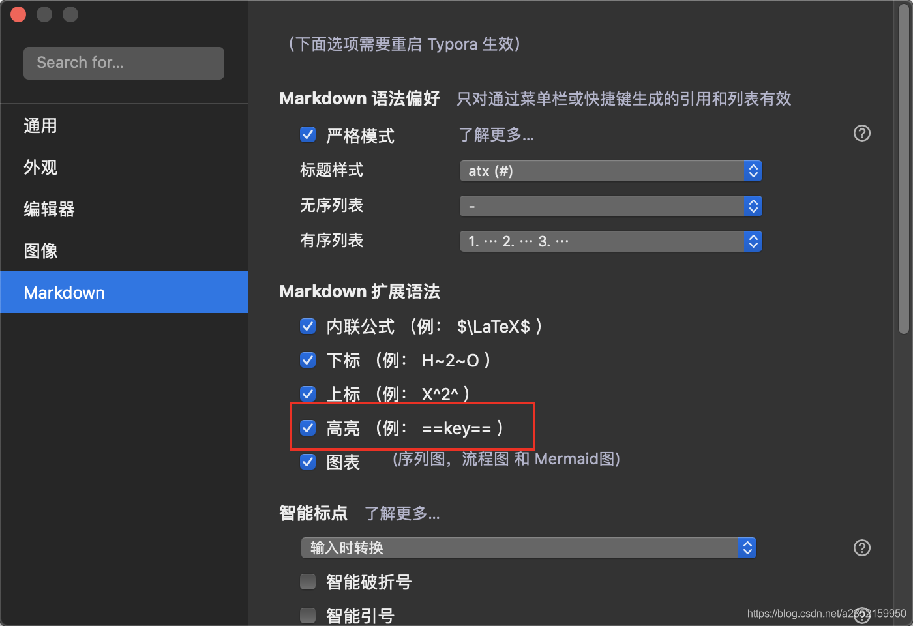
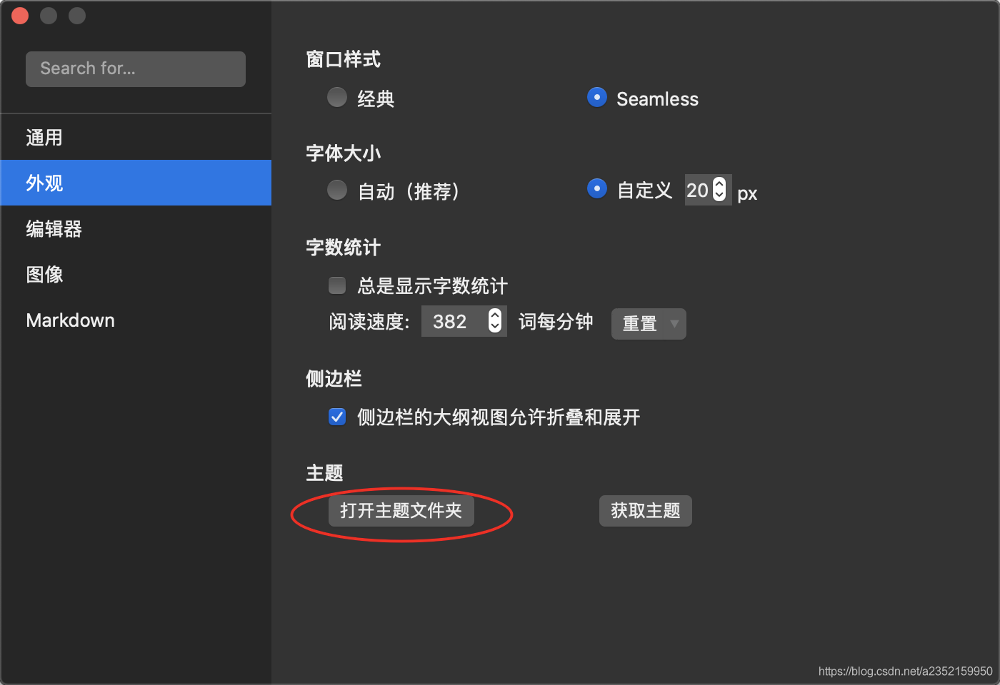
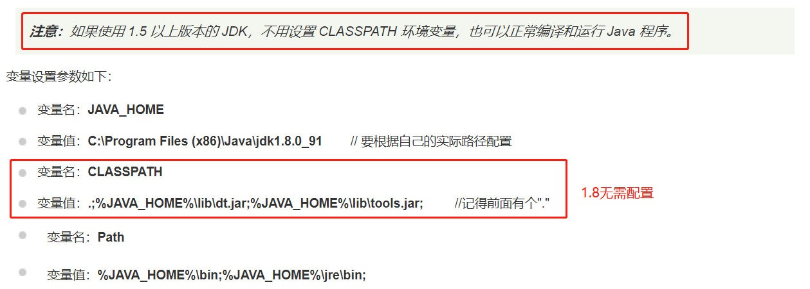

## Java路线笔记

[B站Java学习地址]: https://www.bilibili.com/read/cv5702420	"Java学习完整路线，强烈建议收藏转发"
[GitHub mall项目学习地址]: http://www.macrozheng.com/#/README	"mall学习教程"
[CSDN博主 江南一点雨]: http://www.javaboy.org/	"江南一点雨-博客"
[书籍《SpringBoot+Vue全栈开发实战》]: https://item.jd.com/12521334.html	"江南一点雨出品【王松】"
[度盘黑马Java学习地址]: https://pan.baidu.com/s/1efKiRVjHGqdhd9fgD23yoA	"提取码：ovy3"
[B站黑马java基础教程]: https://www.bilibili.com/video/BV18J411W7cE	"黑马程序员全套Java教程_Java基础入门教程，零基础小白自学Java必备教程"
[B站Spring Cloud学习地址]: https://www.bilibili.com/video/BV18E411x7eT?p=1	"尚硅谷Spring Cloud(H版&amp;alibaba)框架开发教程(大牛讲授spring cloud)"

---

### 0、学习前准备

#### 	1、笔记（Markdown）

- Markdown编辑器： Typora [官网](https://www.typora.io/)  [Typora个性化教程](https://www.bilibili.com/video/BV12T4y1g7se)

- Markdown语法：详见`MarkDown语法.md`

- Typora配置

  - 打开语法高亮

    

  - 设置==高亮==为字体变红，`重点标记`字体变红，修改对应主题 css 文件，加入 mark 样式，修改 code 样式

    ~~~css
    mark {
        background: transparent;
        color: red;
        font-weight: bold;
        border-bottom: 0px solid #ffffff;
        padding: 0.0px;
        margin: 0 0px;
    }
    code {
    	color: #E96900;
        background-color: #f3f4f4;
        padding: 0 2px 0 2px;
    }
    ~~~
    
    

#### 	2、开发环境

##### 1、前端

- Node.js  [官网](https://nodejs.org/zh-cn/download/)  [中文网](http://nodejs.cn/download/)
- WebStorm  [官网](https://www.jetbrains.com/webstorm/)
- [Vue](https://cn.vuejs.org/)  [Element](https://element.eleme.cn/#/zh-CN)  [vue-element-admin](https://panjiachen.github.io/vue-element-admin-site/zh/)

##### 2、后台

- Java SDK（1.8+）  [官网下载地址](https://www.oracle.com/java/technologies/javase/javase-jdk8-downloads.html)

- 配置环境变量 JAVA_HOME  PATH  CLASS_PATH  [环境变量配置](https://www.runoob.com/java/java-environment-setup.html)

  

- MySQL5.7+和Navicat  [MySql5.7+下载](https://downloads.mysql.com/archives/installer/)  [Navicat下载 ](http://www.navicat.com.cn/)  [中文乱码解决方案](https://blog.csdn.net/qq_34694342/article/details/86703068)

- IEDA  [官网](https://www.jetbrains.com/idea/)

#### 	3、IDEA常用快捷键，详见 `IDEA快捷键（全）.md`

| 快捷键               | 说明                                  |
| :------------------- | ------------------------------------- |
| Ctrl + Alt + 空格    | 代码提示                              |
| Ctrl + Alt + Enter   | 换行                                  |
| Ctrl + Alt + L       | 格式化代码                            |
| Ctrl + Alt + T       | 弹出环绕选项弹出层（if，try/catch等） |
| Ctrl + Shift + U     | 切换大小写                            |
| Ctrl + Shift + Enter | 使代码语句完整                        |
| Ctrl + Shirt +  -/+  | 全局代码收缩/展开（不加Shirt为局部）  |
| Ctrl + F/R           | 查找替换                              |
| Alt + Enter          | 快速修复                              |
| Alt + Insert         | 代码生成（get/set，toString等）       |
| Shirt + F6           | 重命名                                |
| Shirt + Tab          | 整体反缩进或缩进（Tab）               |

#### 	4、IDEA配置和常用插件

- **主题：**Appearance & Behavior > Appearance

- **字体：**Editor > Font

- **编码（UTF-8）：**Editor > File Encoding

- **Git显示 push 菜单按钮：**File > Setting > MEnu and ToolBars > Navigation Bar ToolBar > NavBarVcsGroup > 添加符号 > Version Control Systems > Push..（最下面）

- **插件**

  | 名称                           | 说明                                  |
  | :----------------------------- | ------------------------------------- |
  | Alibaba Java Coding Guidelines | 阿里巴巴编码规范                      |
  | Codota                         | 常用代码提示                          |
  | Easy Code                      | 一键生成mapper等                      |
  | Free MyBatis plugin            | MyBatis增强（xml对应关系）            |
  | Lombok                         | Lombok插件（不安装无法使用Lombok）    |
  | Maven Helper                   | Maven导入分析                         |
  | MyBatis Log Plugin             | MyBatis增强（日志SQL转换为可运行SQL） |
  | Statistic                      | 代码统计                              |
  | RESTful Toolkit                | 简单的http调试和接口定位              |
  
- **Maven Settings.xml配置**

  ~~~xml
  <mirrors>
        <mirror>
          <id>nexus-aliyun</id>
          <mirrorOf>central</mirrorOf>
          <name>Nexus aliyun</name>
          <url>http://maven.aliyun.com/nexus/content/groups/public</url>
        </mirror>
    </mirrors>
   
    <profiles>
           <profile>
                <id>jdk-1.8</id>
                <activation>
                  <activeByDefault>true</activeByDefault>
                  <jdk>1.8</jdk>
                </activation>
                <properties>
                  <maven.compiler.source>1.8</maven.compiler.source>
                  <maven.compiler.target>1.8</maven.compiler.target>
                  <maven.compiler.compilerVersion>1.8</maven.compiler.compilerVersion>
                </properties>
           </profile>
    </profiles>
  ~~~


#### 	5、补充说明

- Win + V：打开剪切板
- WIn + 句号：打开表情 / 颜文字 / 符号

### 1、Java基础

> [GitHub开源项目]: https://github.com/Snailclimb/JavaGuide	"JavaGuide"
>
> 文档地址：https://snailclimb.gitee.io/javaguide/#/

#### 	1、JavaSE基础 

[B站遇见狂神说教程]: https://www.bilibili.com/video/BV12J41137hu	"【狂神说Java】Java零基础学习视频通俗易懂"
[百度网盘黑马教程（01和02）]: https://pan.baidu.com/s/1efKiRVjHGqdhd9fgD23yoA	"提取码：ovy3"

#### 	2、网络编程

[OSI七层协议模型和TCP/IP四层模型]: https://blog.csdn.net/freeking101/article/details/77977941

| OSI七层网络模型         | TCP/IP四层概念模型 | 对应网络协议                            |
| :---------------------- | :----------------- | :-------------------------------------- |
| 应用层（Application）   | 应用层             | HTTP、TFTP, FTP, NFS, WAIS、SMTP        |
| 表示层（Presentation）  | --                 | Telnet, Rlogin, SNMP, Gopher            |
| 会话层（Session）       | --                 | SMTP, DNS                               |
| 传输层（Transport）     | 传输层             | **TCP, UDP**                            |
| 网络层（Network）       | 网络层             | IP, ICMP, ARP, RARP, AKP, UUCP          |
| 数据链路层（Data Link） | 数据链路层         | FDDI, Ethernet, Arpanet, PDN, SLIP, PPP |
| 物理层（Physical）      | --                 | IEEE 802.1A, IEEE 802.2到IEEE 802.11    |

- **TCP（打电话）：**transmission control protocol 传输控制协议。 
  - 服务端：ServerSocket （accept() **阻塞**方法监听客户端连接）
  - 客户端：Socket

- **UDP（发短信）：**user data protocol 用户数据报协议。
  - Socket：DatagramSocket（接收端需要指定端口）
  - 数据报文：DatagramPacket（发送端需要指定发送内容和地址 InatAddress，接收端需要指定接收内容缓冲区）
  - 发送端：DatagramSocket.send(DatagramPacket)
  - 接收端（阻塞）：DatagramSocket.receive(DatagramPacket)

> **相同点：**
> 		TCP和UDP都是网络层之上的，传输层协议，都能都能保护网络层的传输，双方的通信都需要开放端口，TCP和UDP中都存在**复用**和**分用**技术。
> **不同点：**
> 		一提到TCP-UDP的区别，大家最容易想到的便是TCP是可靠传输的，UDP是不可靠传输的，下面就简单罗列一下：
>
> | 选项         |                       TCP                        |                          UDP                           |
> | :----------- | :----------------------------------------------: | :----------------------------------------------------: |
> | 可靠性       | 全双工可靠传输无差错，不丢失，不重复，且按序到达 |                     尽最大努力交付                     |
> | 建立连接     |                   需要建立连接                   |                      无需建立连接                      |
> | 数据发送模式 |                    面向字节流                    |                        面向报文                        |
> | 传输方式     |            点对点（不支持广播和多播）            |             一对一，一对多，多对一，多对多             |
> | 首部开销     |                      20字节                      |                         8字节                          |
> | 拥塞机制     |                        有                        |                           无                           |
> | 流量控制     |                        有                        |                           无                           |
> | 系统资源占用 |                对系统资源要求较多                |                   对系统资源要求较少                   |
> | 实时性       |                   相对UDP较低                    | 较高，适用于对高速传输和实时性要求较高的通信或广播通信 |
>
>   **TCP**：不关心应用程序一次性把多长的数据报文发送到TCP缓存中，而是根据对方给出的窗口值和网络拥塞程度决定报文段应该包含多少字节.
>   **UDP**：一次交付一个完整的报文，报文长度由应用程序给出。

#### 	3、多线程基础

##### 1、三种创建线程方式

- 继承Thread类，重写run方法，new，start()
- 实现Runable接口，重写run方法，new Thread()并传入，start() （也可线程池 ThreadPoolExecutor.execute()）
- 实现Callable接口，重写run方法，新建线程池 ThreadPoolExecutor，线程池调用submit()

##### 2、线程状态

~~~java
NEW              // 新生
RUNNABLE         // 运行
BLOCKED          // 阻塞
WAITING          // 无限等待
TIMED_WAITING    // 超时等待
TERMINATED       // 终止
~~~

##### 3、多线程同步

> synchronized 修饰方法 
>
> > **加锁对象为方法的调用者（方法存在的对象）**
> >
> > **若方法为静态方法，加锁对象为类的Class对象（一个类只有一个Class对象）**
>
> synchronized 代码块

##### 4、常用方法

>wait() 应使用在 while 判断中，而不是if，否则可能出现虚假唤醒，即同时if，同时唤醒

~~~java
start()
sleep()   			    // 休眠 不释放锁
wait(long timeout)      // 等待 释放锁（只可使用在同步代码块中）
notify() / notifyAll()  // 唤醒等待中的线程 不释放锁
yield()                 // 当前线程礼让，线程调度重新分配，不一定成功礼让 不释放锁
join()                  // 当前线程进入阻塞等待，join的线程运行 不释放锁
~~~

##### 5、线程池 ThreadPoolExecutor

> 使用 **ThreadPoolExecutor** 创建，而不是 Executors
>
> ```java
> // Executors常用方法
> Executors.newSingleThreadExecutor() // 单线程 线程一直存在
> Executors.newFixedThreadPool(3)     // 固定3个线程 线程一直存在
> Executors.newCachedThreadPool()     // 可伸缩 遇强则强 遇弱则弱 可创建无数个线程
> Executors.newScheduledThreadPool()  // 定时线程池 可创建无数个线程
> ```

- corePoolSize：线程池维护线程最小的数量

- maximumPoolSize：维护线程最大数量

  > - CPU密集型（CPU比硬盘强 ） Runtime.getRuntime().availableProcessors() （获取CPU核心数）
  > - IO密集型（硬盘比CPU强）  IO耗时操作线程 * 2

- keepAliveTime：没有任务执行时最多保持多久时间会终止。

  > 如果调用allowCoreThreadTimeOut(true)方法，在线程池中的线程数不大于corePoolSize时，keepAliveTime参数也会起作用，直到线程池中的线程数为0

- unit：参数keepAliveTime的时间单位

  ```java
  TimeUnit.DAYS;              //天
  TimeUnit.HOURS;             //小时
  TimeUnit.MINUTES;           //分钟
  TimeUnit.SECONDS;           //秒
  TimeUnit.MILLISECONDS;      //毫秒
  TimeUnit.MICROSECONDS;      //微妙
  TimeUnit.NANOSECONDS;       //纳秒
  ```

- workQueue：阻塞队列，在JUC进阶有详细介绍

  ```java
  /*
  是一个不存储元素的阻塞队列，会直接将任务交给消费者，必须等队列中的添加元素被消费后才能继续添加新的元素。使用SynchronousQueue阻塞队列一般要求maximumPoolSizes为无界，避免线程拒绝执行操作。
  */
  ArrayBlockingQueue; // 没有容量，是无缓冲等待队列。
  /*
  当前执行的线程数量达到corePoolSize的数量时，剩余的元素会在阻塞队列里等待，在使用此阻塞队列时maximumPoolSizes就相当于无效了。
  */
  LinkedBlockingQueue; // 无界（没有大小限制）缓存等待队列。
  /*
  可以指定缓存队列的大小，当线程数量大于corePoolSize时，多余的任务会缓存在ArrayBlockingQueue队列中等待有空闲的线程时继续执行；当ArrayBlockingQueue满时，则又会开启新的线程去执行，直到线程数量达到maximumPoolSize；当线程数已经达到最大的maximumPoolSize时，再有新的任务到达时会执行拒绝执行策略（RejectedExecutionException）
  */
  SynchronousQueue; //有界缓存等待队列。
  ```

- threadFactory：线程工厂，一般用来指定线程名称

  ~~~java
  new ThreadFactoryBuilder().setNameFormat("Async-Pool-%d").build()
  ~~~

- handler：拒绝策略（ThreadPoolExecutor.）

  ```java
  AbortPolicy：        //丢弃任务，并且抛出RejectedExecutionException异常
  DiscardPolicy：      //丢弃任务，不处理，不抛出异常
  CallerRunsPolicy：   //只用调用者所在线程来运行任务
  DiscardOldestPolicy：//丢弃队列里最近的一个任务，并执行当前任务，并且重复该操作
  ```

#### 	4、注解和反射

##### 1、元注解

- @Target：描述直接使用范围

  ~~~java
  ElementType.TYPE;            // 接口、类、枚举
  ElementType.FIELD;           // 字段、枚举的常量
  ElementType.METHOD;          // 方法
  ElementType.PARAMETER;       // 方法参数
  ElementType.CONSTRUCTOR;     // 构造函数
  ElementType.LOCAL_VARIABLE;  // 局部变量
  ElementType.ANNOTATION_TYPE; // 注解
  ElementType.PACKAGE;         // 包
  ElementType.TYPE_PARAMETER;  // 声明类型 class MyClass<@myAnno String>{}
  ElementType.TYPE_USE;        // 使用类型（new 强转 形参 泛型） new @myAnnoUse MyClass<>()
  ~~~

- @Retention：什么级别保存该注释信息

  ~~~java
  RetentionPolicy.SOURCE;   // 源码级别
  RetentionPolicy.CLASS;    // class字节码级别
  RetentionPolicy.RUNTIME   // 运行时级别
  ~~~

- @Document：是否包含在javadoc中

- @Inheriter：是否可以从父类继承该注解

- @Repeatable：重复注解（注解中注解，注解子注解并传入父注解class即可）

- @Native：修饰成员变量，则表示这个变量可以被本地代码引用，常常被代码生成工具使用。

##### 2、自定义注解

- 创建：public @interface 注解名
- 参数声明：类型 名称() default 默认值（String value() default ""）
- 只有一个参数时使用value，在实际使用时可以不写value = 

##### 3、反射（一个类只有一个Class对象）

- 获取反射对象

  ```java
  Class.forName();
  Object.getClass();
  类名.class;
  基本数据类型的包装类.Type;
  ...
  ```

- Class类常用方法

  | 方法（添加Declared可获取私有内容）     | 说明                                                     |
  | -------------------------------------- | -------------------------------------------------------- |
  | static forName(String name)            | 返回指定类名name的Class对象                              |
  | Object newlnstance()                   | 调用缺省构造函数,返回Class对象的一个实例                 |
  | getName()                              | 返回此Class对象所表示的实体(类,接口,数组类或void)的名称. |
  | Class getSuperClass()                  | 返回当前Class对象的父类的Class对象                       |
  | Class[] getinterfaces()                | 获取当前Class对象的接口                                  |
  | ClassLoader getClassLoader()           | 返回该类的类加载器                                       |
  | Constructor[] getConstructors()        | 返回一个包含某些Constructor对象的数组                    |
  | Method getMothed(String name,Class..T) | 返回一个Method对象,此对象的形参类型为paramType           |
  | Field[] getDeclaredFields()            | 返回Field对象（字段）的一个数组                          |

- 动态创建和执行方法

  ~~~java
  // 创建
  Class.newlnstance();
  Constructor.newInstance(参数);
  // 执行方法
  Method.invoke(对象, 值);
  Field.set(对象，值);
  ...
  // Method，Field，Constructor均有 setAccessible(boolean) 方法，设置为true，关闭安全检查，可以访问私有，同时可以极大提高执行速度
  ~~~

- 获取泛型信息

  ~~~java
  Method.getParameterTypes();   // 传入值类型
  Method.getReturnType();       // 返回值类型
  ...
  ~~~

- 获取注解信息

  ~~~java
  // Field，Method等都有此方法
  Class.getAnnotions();
  Class.getAnnotion(class);
  Class.getAnnotion(class).value();
  ...
  ~~~

#### 5、知识扩展（重要）

> **必须通读（阿里巴巴开源项目p3c）：`Java开发手册（嵩山版）.pdf`**

- **使用 `try-with-resources` 来代替 `try-catch-finally`**

  > 1. **适用范围（资源的定义）：** 任何实现 `java.lang.AutoCloseable`或者 `java.io.Closeable` 的对象
  > 2. **关闭资源和 finally 块的执行顺序：** 在 `try-with-resources` 语句中，任何 catch 或 finally 块在声明的资源关闭后运行
  >
  > 面对必须要关闭的资源，我们总是应该优先使用 `try-with-resources` 而不是`try-finally`。随之产生的代码更简短，更清晰，产生的异常对我们也更有用。`try-with-resources` 语句让我们更容易编写必须要关闭的资源的代码，若采用`try-finally`则几乎做不到这点。

  Java 中类似于`InputStream`、`OutputStream` 、`Scanner` 、`PrintWriter` 等的资源都需要我们调用 `close()` 方法来手动关闭，一般情况下我们都是通过`try-catch-finally` 语句来实现这个需求，如下：

  ```java
  //读取文本文件的内容
  Scanner scanner = null;
  try {
      scanner = new Scanner(new File("D://read.txt"));
      while (scanner.hasNext()) {
          System.out.println(scanner.nextLine());
      }
  } catch (FileNotFoundException e) {
      e.printStackTrace();
  } finally {
      if (scanner != null) {
          scanner.close();
      }
  }
  ```

  使用 Java 7 之后的 `try-with-resources` 语句改造上面的代码:

  ```java
  try (Scanner scanner = new Scanner(new File("test.txt"))) {
      while (scanner.hasNext()) {
          System.out.println(scanner.nextLine());
      }
  } catch (FileNotFoundException fnfe) {
      fnfe.printStackTrace();
  }
  ```

  当然多个资源需要关闭的时候，使用 `try-with-resources` 实现起来也非常简单，如果你还是用`try-catch-finally`可能会带来很多问题。

  通过使用分号分隔，可以在try-with-resources` 块中声明多个资源。

  ```java
  try (BufferedInputStream bin = new BufferedInputStream(new FileInputStream(new File("test.txt")));
       BufferedOutputStream bout = new BufferedOutputStream(new FileOutputStream(new File("out.txt")))) {
      int b;
      while ((b = bin.read()) != -1) {
          bout.write(b);
      }
  }
  catch (IOException e) {
      e.printStackTrace();
  }
  ```

- **Java 序列化中如果有些字段不想进行序列化，怎么办？**

  对于不想进行序列化的变量，使用 `transient` 关键字修饰。

  `transient` 关键字的作用是：阻止实例中那些用此关键字修饰的的变量序列化；当对象被反序列化时，被 `transient` 修饰的变量值不会被持久化和恢复。

  关于 `transient` 还有几点注意：

  - `transient` 只能修饰变量，不能修饰类和方法。
  - `transient` 修饰的变量，在反序列化后变量值将会被置成类型的默认值。例如，如果是修饰 `int` 类型，那么反序列后结果就是 `0`。
  - `static` 变量因为不属于任何对象(Object)，所以无论有没有 `transient` 关键字修饰，均不会被序列化。
  
- **需要 Map 的主键和取值时，应该迭代 entrySet()**

  > 当循环中只需要 Map 的主键时，迭代 keySet() 是正确的。但是，当需要主键和取值时，迭代 entrySet() 才是更高效的做法，比先迭代 keySet() 后再去 get 取值性能更佳。

- **集合初始化尽量指定大小**

  >  java 的集合类用起来十分方便，但是看源码可知，集合也是有大小限制的。每次扩容的时间复杂度很有可能是 O(n) ，所以尽量指定可预知的集合大小，能减少集合的扩容次数。

- **某些场景（如循环中）字符串拼接使用 StringBuilder** 

  > `一般的字符串拼接在编译期 java 会进行优化`，但是在循环中字符串拼接， java 编译期无法做到优化，所以需要使用 StringBuilder 进行替换。

- **频繁调用 Collection.contains 方法使用 Set**

  > 在 java 集合类库中，List 的 contains 方法普遍时间复杂度是 O(n) ，如果在代码中需要频繁调用 contains 方法查找数据，可以先将 list 转换成 HashSet 实现，将 O(n) 的时间复杂度降为 O(1) 。

- **尽量不使用双大括号初始化类**

  > 以 ArrayList list = new ArrayList<String>(){{ }} 为例
  >
  > 第一层大括号：定义了一个继承 ArrayList 的匿名内部类
  >
  > 第二层大括号：非静态代码块（主要用于对象的初始化操作，在每次创建对象时都要调用一次，其执行顺序在构造方法之前）
  >
  > **其效率较低，实际为 ArrayList的 子类的引用，class 为内部类而不是 Arraylist**

- **工具类构造函数应为私有，防止实例化**

- **使用 String.valueOf(value) 代替 "" + value**

  > 当要把其它对象或类型转化为字符串时，使用 String.valueOf(value) 比""+value 的效率更高。

- **小心String.split(String regex)**

  > 字符串 String 的 split 方法，传入的分隔字符串是正则表达式！部分关键字（比如.[]()\| 等）需要转义

  **反例：**

  ```java
  "a.ab.abc".split("."); // 结果为[]
  "a|ab|abc".split("|"); // 结果为["a", "|", "a", "b", "|", "a", "b", "c"]
  ```

  **正例：**

  ```java
  "a.ab.abc".split("\\."); // 结果为["a", "ab", "abc"]
  "a|ab|abc".split("\\|"); // 结果为["a", "ab", "abc"]
  ```


### 	2、JVM基础

[基础知识]: https://www.bilibili.com/video/BV1iJ411d7jS	"【狂神说Java】JVM快速入门篇"

> 待补充，概念性知识

### 	3、JUC进阶（多线程高阶）

> JUC：java.util.concurrent包缩写
>
> Java没有操作硬件的能力，开启线程执行的是native本地方法

#### 1、锁 Lock / 读写锁 ReadWriteLock

> **所有的锁都是可重入锁（递归锁）**，即获得外部的锁后自动获取内部的锁
>
> **使用锁必须配对**

##### 1、ReentrantLock：

> 默认为非公平：随机分配锁（与synchranized关键字效果相同，但是更加灵活，提供tryLock()和isLocked()等方法）
>
> 传入true为公平：排队获得锁

~~~java
Lock lock = new ReentrantLock();
// 加锁
lock.lock();
try {
    // 业务逻辑
    System.out.println("...");
} catch (Exception e) {
    e.printStackTrace();
} finally {
    // 释放锁
    lock.unlock();
}
~~~

##### 2、ReentrantReadWriteLock：读写锁

> 更加细粒度的控制锁，分为读锁（共享锁）和写锁（独占锁）

~~~java
ReadWriteLock lock = new ReentrantReadWriteLock();
// 加读锁 / 写锁
lock.writeLock().lock(); // lock.readLock().lock();
try {
    // 业务逻辑
    System.out.println("...");
} catch (Exception e) {
    e.printStackTrace();
} finally {
    // 释放读锁 / 写锁
    lock.writeLock().unlock();  // lock.readLock().unlock();
}
~~~

#### 2、Condition

> Lock.newCondition() 或ReadWriteLock.newCondition()获取，可获取多个，用于**精准通知**
>
> 替代wait() 和 notify() / notifyAll()

- await()  替代 wait()
- signal() / signalAll()  替代 notify() / notifyAll()

#### 3、多线程不安全的类

- **StringBuilder（可用StringBuffer替代）**

- **Collection集合**

  - List（可用以下方法替代）

    > - Vector（synchronized  不推荐使用）
    > - Collections.synchronizedList()
    > - CopyOnWriteArrayList()（写入时复制  推荐）

  - Set（可用以下方法替代）元素不可相等，本质为HashMap

    > - Collections.synchronizedSet()
    > - CopyOnWriteArraySet()

  - Map（可用以下方法替代）

    > - Collections.synchronizedMap()
    > - ConcurrentHashMap

#### 4、Callable接口

> 类似Runnable，但是有返回值，并且可以抛出异常 方法改为call()而不是run()
>
> 使用时通过线程池 submit() 或者 new Thread(new FutureTask(callable)).start() 并通过 FutureTask.get()  **阻塞** 方法获取返回值

#### 5、常用辅助类

##### 1、减法计数器  CountDownLatch

> 初始化时指定大小，调用 countDown() 减一，归零后执行 await() 后的方法
>
> count最小到0，到0后执行 await() 后方法，此时依然可以 countDown() 但没有任何效果

~~~java
// 初始化CountDownLatch 指定大小为5
CountDownLatch latch = new CountDownLatch(5);
// 开启8个线程 分别减一
for (int i = 0; i < 8; i++) {
    new Thread(() -> {
        latch.countDown();
        System.out.println(Thread.currentThread().getName() + "--->" + latch.getCount());
    }).start();
}
// 等待计数器归零
latch.await();
System.out.println("+++++++++");
}
// ------输出结果如下------
Thread-0--->4
Thread-1--->3
Thread-2--->2
Thread-4--->1
Thread-6--->0
+++++++++
Thread-7--->0
Thread-3--->0
Thread-5--->0
~~~

##### 2、加法计数器 / 循环栅栏 CyclicBarrier

> 初始化时指定大小（和达到大小是执行的方法），调用 await() 加一，调用的线程进入等待
>
> 达到大小时，由最后一个线程执行初始化时指定的方法，**同时归零，重新计数**
>
> 然后 await() 之后的方法执行（线程唤醒）

~~~java
// 初始化大小为5，达到时输出 +++++++++
CyclicBarrier cyclicBarrier = new CyclicBarrier(5, () -> System.out.println(Thread.currentThread().getName() + "+++++++++"));
// 开启8个线程 每个线程 await() 加一
for (int i = 0; i < 8; i++) {
    new Thread(() -> {
        System.out.println(Thread.currentThread().getName() + "---->等待");
        try {
            cyclicBarrier.await();
        } catch (Exception e) {
            e.printStackTrace();
        }
        System.out.println(Thread.currentThread().getName() + "-->继续");
    }).start();
}
// ------输出结果如下------
Thread-2---->等待
Thread-1---->等待
Thread-3---->等待
Thread-4---->等待
Thread-5---->等待
Thread-5+++++++++
Thread-5-->继续
Thread-2-->继续
Thread-1-->继续
Thread-3-->继续
Thread-4-->继续
Thread-6---->等待
Thread-8---->等待
Thread-7---->等待
~~~

##### 3、停车位 / 信号量 / 限流 Semaphore

> 初始化时指定大小（和是否实现公平机制，排队）
>
> 线程调用 acquire() 停车加锁，结束后调用 release() 出发释放锁
>
> 其他线程在大小已满的时候等待，有位置则停车

~~~java
// 初始化车位3个 非公平（默认）
Semaphore semaphore = new Semaphore(3,false);
// 开启6个线程 停车
for (int i = 0; i < 6; i++) {
    new Thread(() -> {
        try {
            // 有车位则进入
            semaphore.acquire();
            System.out.println(Thread.currentThread().getName() + "---->停车");
            // 停车2秒后出发
            TimeUnit.SECONDS.sleep(2);
            System.out.println(Thread.currentThread().getName() + "-->出发");
        } catch (Exception e) {
            e.printStackTrace();
        }finally {
            semaphore.release();
        }
    }).start();
}
// ------输出结果如下------
Thread-0---->停车
Thread-1---->停车
Thread-2---->停车
Thread-2-->出发
Thread-1-->出发
Thread-0-->出发
Thread-3---->停车
Thread-5---->停车
Thread-4---->停车
Thread-5-->出发
Thread-4-->出发
Thread-3-->出发
~~~

#### 6、队列 Qeque

> 先进先出

- **阻塞队列  BlockingQueue**

  > 常用 ArrayBlockingQueue 和 LinkedBlockingQueue

  | 方式       | 抛出异常  | 不抛出异常，有返回值 | 阻塞等待 | 超时等待          |
  | ---------- | --------- | -------------------- | -------- | ----------------- |
  | 进入       | add()     | offer()              | put()    | offer()  传入时间 |
  | 移除       | remove()  | poll()               | take()   | poll()  传入时间  |
  | 获取首元素 | element() | peek()               | -        | -                 |

- **非阻塞队列   AbstractQueue**

  > 常用 ConcurrentLinkedQueue

- **同步队列  SynchronousQueue**

  > 没有容量，进入一个元素，必须等待取出后才能继续放入元素
  >
  > 使用 put() 存入，take() 取出

- **双端队列  Deque**

#### 7、异步回调  CompletableFuture

> 执行异步方法，获取成功或异常返回值，类似于 http 异步请求
>
> 也可使用 Callable 接口和 FutureTask 实现，或者线程池 submit 方法实现
>
> [详细使用参考]: https://www.jianshu.com/p/cacb8162f409?utm_medium=timeline&amp;utm_source=oschina-app	"Java8异步编程-CompletableFuture"

~~~java
// 无返回值
CompletableFuture<Void> voidCompletableFuture = CompletableFuture.runAsync(() -> {
    System.out.println("...");
});
// 有返回值
CompletableFuture<Object> uCompletableFuture = CompletableFuture.supplyAsync(() -> {
    System.out.println("...");
    return null;
});
// 获取结果 具体方法查看下表
Object result = uCompletableFuture.whenComplete((o, throwable) -> {
    System.out.println("返回值：" + o);
    System.out.println("异常：" + throwable);
}).exceptionally(throwable -> {
    System.out.println("异常：" + throwable);
    return throwable;
}).get();
~~~

| 特点   | thenApply 传递结果 | thenAccept 消费结果 | thenRun 触发回调 | whenComplete 收集结果 | exceptionally 异常处理 |
| ------ | ------------------ | ------------------- | ---------------- | --------------------- | ---------------------- |
| 入参   | 上一级结果         | 上一级结果          | 无               | 结果 + 异常           | 异常                   |
| 返回值 | 本次的结果         | 无                  | 无               | 无                    | 异常时的结果           |

#### 8、JMM 和 volatile

> **JMM：**Java 内存模型，概念性，实际不存在
>
> **volatile：**Java语言提供了一种稍弱的同步机制，用来确保将变量的更新操作通知到其他线程
>
> > 　　当把变量声明为volatile类型后，编译器与运行时都会注意到这个**变量是共享的**，因此**不会将该变量上的操作与其他内存操作一起重排序**。volatile变量不会被缓存在寄存器或者对其他处理器不可见的地方，因此在读取volatile类型的变量时总会返回最新写入的值。
> >
> > 　　在访问volatile变量时**不会执行加锁操作**，因此也就不**会使执行线程阻塞**，因此**volatile变量是一种比sychronized关键字更轻量级的同步机制**。
> >
> > 
> >
> > 　　当对**非 volatile 变量进行读写**的时候，每个线程先从内存拷贝变量到CPU缓存中。如果计算机有多个CPU，每个线程可能在不同的CPU上被处理，这意味着每个线程可以拷贝到不同的 CPU cache 中。
> >
> > 　　而**声明变量是 volatile** 的，JVM 保证了每次读变量都从内存中读，跳过 CPU cache 这一步。
> >
> > **指令重排序：**是指CPU采用了允许将多条指令不按程序规定的顺序分开发送给各相应电路单元处理

##### 1、JMM内存交互

> 内存交互操作有8种，虚拟机实现必须保证每一个操作都是原子的，不可在分的（对于double和long类型的变量来说，load、store、read和write操作在某些平台上允许例外）

- lock   （锁定）：作用于主内存的变量，把一个变量标识为线程独占状态
- unlock （解锁）：作用于主内存的变量，它把一个处于锁定状态的变量释放出来，释放后的变量才可以被其他线程锁定
- read  （读取）：作用于主内存变量，它把一个变量的值从主内存传输到线程的工作内存中，以便随后的load动作使用
- load   （载入）：作用于工作内存的变量，它把read操作从主存中变量放入工作内存中
- use   （使用）：作用于工作内存中的变量，它把工作内存中的变量传输给执行引擎，每当虚拟机遇到一个需要使用到变量的值，就会使用到这个指令
- assign （赋值）：作用于工作内存中的变量，它把一个从执行引擎中接受到的值放入工作内存的变量副本中
- store  （存储）：作用于主内存中的变量，它把一个从工作内存中一个变量的值传送到主内存中，以便后续的write使用
- write 　（写入）：作用于主内存中的变量，它把store操作从工作内存中得到的变量的值放入主内存的变量中

> 　JMM对这八种指令的使用，制定了如下规则：

- 不允许read和load、store和write操作之一单独出现。即使用了read必须load，使用了store必须write
- 不允许线程丢弃他最近的assign操作，即工作变量的数据改变了之后，必须告知主存
- 不允许一个线程将没有assign的数据从工作内存同步回主内存
- 一个新的变量必须在主内存中诞生，不允许工作内存直接使用一个未被初始化的变量。就是怼变量实施use、store操作之前，必须经过assign和load操作
- 一个变量同一时间只有一个线程能对其进行lock。多次lock后，必须执行相同次数的unlock才能解锁
- 如果对一个变量进行lock操作，会清空所有工作内存中此变量的值，在执行引擎使用这个变量前，必须重新load或assign操作初始化变量的值
- 如果一个变量没有被lock，就不能对其进行unlock操作。也不能unlock一个被其他线程锁住的变量
- 对一个变量进行unlock操作之前，必须把此变量同步回主内存

##### 2、volatile特性

- 保证可见性

  > 两个线程同时操作一个变量，一个线程改变变量值后，另一个线程可以获取到新的值
  >
  > 如果不添加 volatile 关键字，线程在退出前不会感知到外部引入的变量的变化

  ~~~java
  // 定义变量，不添加 volatile 时线程1不会停止
  private volatile static boolean flag = false;
  public static void main(String[] args) throws InterruptedException {
      // 线程1
      new Thread(() -> {
          while (true){
              // 判断变量为 true 则退出
              if (flag) break;
          }
      }).start();
      // 休眠一秒，保证线程1已经执行
      TimeUnit.SECONDS.sleep(2);
      // 启动线程2修改 flag 为 true
      new Thread(() -> flag = true).start();
  }
  ~~~

- 不保证原子性

  > 要保证原子性应使用**原子类 java.util.concurrent.atomic，底层为CAS**
  >
  > 也可使用 synchronized 关键字，但效率远不及原子类 + volatile
  >
  > **原子性：**一个操作一旦开始，就不会被其它线程干扰，**仅执行一步操作**
  >
  > > ```java
  > > i = 0;       // 对基本数据类型的变量和赋值操作都是原子性操作
  > > j = i ;      // 包含了两个操作：读取i，将i值赋值给j
  > > i++;         // 包含了三个操作：读取i值、i + 1 、将+1结果赋值给i
  > > i = j + 1;   // 包含了三个操作：读取i值、i + 1 、将+1结果赋值给i
  > > ```

  ~~~java
  private volatile static int flag = 0; // AtomicInteger flag = new AtomicInteger()
  // 理论执行完毕打印结果应为 200000
  public static void main(String[] args) throws InterruptedException {
      // 初始化计数器
      CountDownLatch latch = new CountDownLatch(20);
      // 启动20个线程
      for (int i = 0; i < 20; i++) {
          new Thread(() -> {
              for (int j = 0; j < 10000; j++) {
                  // 执行非原子性操作
                  flag++; // flag.getAndIncrement()
              }
              latch.countDown();
          }).start();
  
      }
      // 等待子线程执行完毕
      latch.await();
      System.out.println(flag);
  }
  // ------输出结果如下------
  124164
  ~~~

- 禁止指令重排

  > **指令重排：**对代码指令进行重新排序，不一定和源代码顺序相同
  >
  > > 编译器和CPU 会尝试重排指令使得代码更快地运行，因为CPU的运行速度大于内存的读写速度
  >
  > 内存屏障保证了不会指令重排
  >
  > [详细解释1]: https://blog.csdn.net/qq_41950447/article/details/97388477	"指令重排"
  > [详细解释2]: https://blog.csdn.net/pzxwhc/article/details/48984209	"Java JVM（十二）：指令重排序"

#### 9、单例模式

> 对象只被初始化一次，且不会产生新的实例

##### 1、饿汉式

> 类装载的时候就会创建类实例
>
> 空间换时间

~~~java
public class MyClass{
    // 构造方法私有化
    private MyClass(){

    }
    // 初始化时创建对象 （也可使用静态代码块创建对象）
    private final static MyClass instance = new MyClass();

    // 一样会被初始化，可能浪费内存空间
    private int a = 0;
    
    // 提供静态方法返回对象
    public static MyClass getInstance(){
        return instance;
    }
}
~~~

##### 2、DCL懒汉式（Double Check Lock）

> 延时加载，等到需要使用时，才去加载。
>
> 时间换空间
>
> 不加同步的懒汉式是线程不安全的，因为内部判断使用的是 if ，可能多个线程同时读取到

~~~java
public class MyClass{
    // 构造方法私有化
    private MyClass(){

    }
    // 初始化时不创建对象 添加 volatile 保证多线程下不会指令重排
    private volatile static MyClass instance = null;

    // 需要加载时才会初始化
    private int a = 0;

    // 提供静态方法返回对象
    public static MyClass newInstance(){
        // 双重检验所 保证多线程下的单例
        // 如果不加外层的判空 会浪费资源（加锁和解锁）
        if (instance == null){
            synchronized (MyClass.class){
                if (instance == null){
                    // 非原子性操作 可能发生指令重排
                    // 在指向分配的内存空间后非null，此时可能还没有调用构造器
                    instance = new MyClass();
                }
            }
        }
        return instance;
    }
}
~~~

##### 3、懒汉式  静态内部类（推荐）

```java
public class MyClass{
    // 构造方法私有化
    private MyClass(){

    }

    // 在第一次调用时才会初始化
    public static MyClass getInstance(){
        return InnerClass.MY_CLASS;
    }

    // 私有的静态内部类 只有类本身可以调用
    private static class InnerClass{
        private static final MyClass MY_CLASS = new MyClass();
    }
}
```

##### 4、枚举（最推荐） 

~~~java
public enum MyClass{
    INSTANCE;

    private int a = 0;
    
    public void doSomething(){
        System.out.println("...");
    }
}
// 调用时
MyClass.INSTANCE.doSomething();
~~~

##### 5、破坏单例模式的因素及解决方案

- 反射（无法破坏枚举）

  > 通过获取Class对象调用构造方法获取实例

  ~~~java
  // 可使用此方法防止反射获取实例，但flag标志位依然可能被反射修改
  private static boolean flag = false;
  private MyClass(){
      synchronized (MyClass.class){
          if (!flag){
              flag = true;
          }else {
              throw new RuntimeException("不要使用反射尝试破坏单例");
          }
      }
  }
  ~~~

- clone() 克隆（无法破坏枚举）

  > 对于implements Cloneable且重写了clone方法的生效
  >
  > 枚举clone方法为私有方法，无法重写，故无法破坏枚举

  ~~~java
  Object clone = MyClass.getInstance().clone();
  ~~~

- 序列化和反序列化（无法破坏枚举）

  > 对于implements Serializable生效
  >
  > 单例对象获取后进行序列化，再反序列化获取实例（org.apache.commons.lang3）

  ~~~java
  byte[] serialize = SerializationUtils.serialize(MyClass.getInstance());
  MyClass deserialize = (MyClass) SerializationUtils.deserialize(serialize);
  ~~~

#### 10、CAS  比较并交换

> 原子类的方法 **compareAndSet(int expect, int update)** 比较并交换（如果是期望值则更新为更新值）
>
> expect为期望值，update为更新值
>
> **底层为 native 本地方法（UnSafe类），用于操作内存**

- **ABA问题**

  > 多线程下调用CAS
  >
  > 一个线程使用两次CAS，A -> B 后 B -> A
  >
  > 另一个线程调用CAS时，A已经不是以前的A了
  >
  > 使用**原子引用AtomicStampedReference**解决，与**乐观锁**原理相同

  ~~~java
  // 指定初始值和时间戳
  AtomicStampedReference<Integer> reference = new AtomicStampedReference<>(0, 1);
  // 获取初始时间戳
  int stamp = reference.getStamp();
  // CAS更新时同时更新时间戳
  reference.compareAndSet(0, 1, stamp, reference.getStamp() + 1);
  reference.compareAndSet(1, 0, reference.getStamp(), reference.getStamp() + 1);
  // 修改失败 时间戳不是期望值
  reference.compareAndSet(0, 1, stamp, reference.getStamp() + 1);
  ~~~

  **CAS内部比较使用的是 == ，对于Integer等包装类时存在问题，超出范围会重新开辟空间，导出 == 判断为flase**

  **业务使用一般使用类User等，而不直接使用包装类**

#### 11、自旋锁

> 不断的尝试，直到获得锁，线程不会进入等待状态，而是一直处于运行状态

~~~java
public class MyLock {

    private AtomicReference<Thread> reference = new AtomicReference<>();
	// 加锁
    public void lock(){
        Thread thread = Thread.currentThread();
        while (!reference.compareAndSet(null, thread)) {

        }
    }
	// 解锁
    public void unLock(){
        Thread thread = Thread.currentThread();
        reference.compareAndSet(thread, null);
    }
}
~~~

#### 12、死锁排查

~~~shell
jps -l        # 查看进程号
jstask 进程号  # 查看堆栈信息
~~~

### 4、Java 8 新特性（常用）

#### 1、Lambda表达式和函数式接口

> Lambda表达式 ( String x, Double y) -> { }   （仅应用于函数式接口）
>
> 函数式接口为只存在一个方法的接口，使用@FunctionalInterface注解标识

- 常用函数式接口

  | 接口           | 方法               | 说明                      |
  | -------------- | ------------------ | ------------------------- |
  | Supplier<T>    | T get();           | 生产，获得T               |
  | Consumer<T>    | void accept(T t);  | 消费，使用T               |
  | Function<T, R> | R apply(T t);      | 函数式，T 计算等得到 R    |
  | Predicate<T>   | boolean test(T t); | 断言，断定 T 是否符合掉件 |

- 函数式接口扩展

  | 接口                | 方法                     | 说明                       |
  | ------------------- | ------------------------ | -------------------------- |
  | BiFunction<T, U, R> | R apply(T t, U u);       | 函数扩展 T 和 U 计算得到 R |
  | UnaryOperator<T>    | T apply(T t);            | 函数扩展 T 计算得到 T      |
  | BinaryOperator<T>   | T apply(T t1, T t2);     | 函数扩展 两个 T 计算得到 T |
  | BiConsumer<T, U>    | void accept(T t, U u);   | 消费型扩展                 |
  | ToIntFunction<T>    | int applyAsInt(T value); | T => int                   |
  | IntFunction<R>      | R apply(int value);      | int => R                   |

#### 2、Stream 流

> 用于集合类，常用 Collection.stream()
>
> LongStream  DoubleStream  IntStream 用于生成基础类型流
>
> > 初始化：range()，rangeClosed()，of() 等
> >
> > 聚合方法：sum()，average()，sorted() 等

- 筛选和切片

  ~~~java
  filter(Predicate p)       // 过滤
  distinct()                // 去重（根据hashcode和equals）
  skip(long n)              // 跳过前n个 不足n个返回空流
  limit(long maxSize)       // 截短使其不会超过maxSize
  ~~~

- 映射

  ~~~java
  map(Function<? super T, ? extends R>                                   // 元素转换或提取
  flatMap(Function<? super T, ? extends Stream<? extends R>> mapper)     // 元素转换或提取后转换为新的流
  ~~~

- 排序

  ```java
  sorted()                           // 自然排序（a-b-c）
  sorted(Comparator comparator)      // 自定义排序
  ```

- 查找与匹配

  ~~~java
  allMatch(Predicate p)              // 是否匹配所有
  anyMatch(Predicate p)              // 是否存在正确匹配
  noneMatch(Predicate p)             // 是否不匹配所有
  findFirst()                        // 获取第一个元素
  findAny()                          // 获取任意一个元素
  count()                            // 统计统计条数
  max(Comparator comparator)         // 获取最大
  min(Comparator comparator)         // 获取最小
  ~~~

- 规约和收集

  ~~~java
  reduce()                           // 元素结合并返回类型值
  collect()                          // 元素结合并转换为其他数据形式（提供了Collects工具类）
  ~~~

- 并行和串行

  ```java
  parallel()                        // 切换到并行（Fork/Join框架，一个任务分多个子任务执行后连接，大数据量计算时使用）
  sequential()                      // 切换到串行
  ```

#### 3、新的日期和时间

> 线程安全

- 基础时间

  > LocalDate  LocalTime  LocalDateTime 
  >
  > LocalDateTime.now()

- 时间戳和时间间隔计算

  > Instant Duration（时间计算） Period（日期计算）
  >
  > Duration.between(start, stop).toMillis()

- 时间矫正器 

  > TemporalAdjuster（提供了TemporalAdjusters工具类）
  >
  > LocalDateTime.now().with(TemporalAdjusters.firstDayOfYear())

### 5、前端基础

#### 	1、H5

> [W3school](https://www.w3school.com.cn/html/html5_intro.asp)  [菜鸟教程](https://www.runoob.com/html/html5-intro.html)

#### 	2、CSS3

>  [W3school](https://www.w3school.com.cn/css/index.asp)  [菜鸟教程](https://www.runoob.com/css3/css3-tutorial.html)

#### 	3、JavaScript 

> [W3school](https://www.w3school.com.cn/js/index.asp)  [菜鸟教程](https://www.runoob.com/js/js-tutorial.html)

### 6、数据库

#### 	1、MySQL

> 使用见 base 或 basic 项目
>
> 查看：show variables like 'max_allowed_packet';
>
> 临时设置（需要重新进行MySQL连接）：set global max_allowed_packet = 10 * 1024 * 1024;

#### 	2、SqlServer

> 使用见 bf 项目

#### 	3、Oracle

> 使用见 bf 项目

#### 4、NoSQL

> 非关系型数据库
>
> Not Only SQL 不仅仅是SQL

- **键值(Key-Value)存储数据库**

  > 这一类数据库主要会使用到一个[哈希表](https://baike.baidu.com/item/哈希表)，这个表中有一个特定的键和一个指针指向特定的数据。Key/value模型对于IT系统来说的优势在于简单、易部署。但是如果[数据库管理员](https://baike.baidu.com/item/数据库管理员/1216449)([DBA](https://baike.baidu.com/item/DBA/3349))只对部分值进行查询或更新的时候，Key/value就显得效率低下了。举例如：Tokyo Cabinet/Tyrant， Redis， Voldemort， Oracle BDB。

- **列存储数据库**

  > 这部分数据库通常是用来应对分布式存储的海量数据。键仍然存在，但是它们的特点是指向了多个列。这些列是由列家族来安排的。如：Cassandra， HBase， Riak.

- **文档型数据库**

  > 文档型数据库的灵感是来自于Lotus Notes办公软件的，而且它同第一种键值存储相类似。该类型的数据模型是版本化的文档，半结构化的文档以特定的格式存储，比如JSON。文档型数据库可以看作是键值数据库的升级版，允许之间嵌套键值，在处理网页等复杂数据时，文档型数据库比传统键值数据库的查询效率更高。如：CouchDB， MongoDb. 国内也有文档型数据库SequoiaDB，已经开源。

- **图形(Graph)数据库**

  > 图形结构的数据库同其他行列以及刚性结构的SQL数据库不同，它是使用灵活的图形模型，并且能够扩展到多个服务器上。NoSQL数据库没有标准的查询语言(SQL)，因此进行数据库查询需要制定数据模型。许多NoSQL数据库都有REST式的数据接口或者查询API。如：Neo4J， InfoGrid， Infinite Graph。

**不同分类特点对比**

| **分类**              | **Examples举例**                                          | 典型应用场景                                                 | 数据模型                                        | 优点                                                         | 缺点                                                         |
| --------------------- | --------------------------------------------------------- | ------------------------------------------------------------ | ----------------------------------------------- | ------------------------------------------------------------ | ------------------------------------------------------------ |
| **键值（key-value）** | Tokyo Cabinet/Tyrant， **Redis**， Voldemort， Oracle BDB | 内容缓存，主要用于处理大量数据的高访问负载，也用于一些日志系统等等。 | Key 指向 Value 的键值对，通常用hash table来实现 | 查找速度快                                                   | 数据无结构化，通常只被当作字符串或者二进制数据               |
| **列存储数据库**      | Cassandra， **HBase**， Riak                              | 分布式的文件系统                                             | 以列簇式存储，将同一列数据存在一起              | 查找速度快，可扩展性强，更容易进行分布式扩展                 | 功能相对局限                                                 |
| **文档型数据库**      | CouchDB， **MongoDb**                                     | Web应用（与Key-Value类似，Value是结构化的，不同的是数据库能够了解Value的内容） | Key-Value对应的键值对，Value为结构化数据        | 数据结构要求不严格，表结构可变，不需要像关系型数据库一样需要预先定义表结构 | 查询性能不高，而且缺乏统一的查询语法。                       |
| **图形(Graph)数据库** | **Neo4J**， InfoGrid， Infinite Graph                     | 社交网络，推荐系统等。专注于构建关系图谱                     | 图结构                                          | 利用图结构相关算法。比如最短路径寻址，N度关系查找等          | 很多时候需要对整个图做计算才能得出需要的信息，而且这种结构不太好做分布式的集群方案。 |

### 7、JavaWeb基础

#### 	1、...

### 8、SSM

#### 	1、Spring5

> [学习参考]: https://www.bilibili.com/video/BV1Vf4y127N5	"尚硅谷-Spring5框架最新版教程（idea版）"

- **WebFlux 响应式编程**

  > 基于 Reactor 而非 Servlet
  >
  > 使用 Netty 启动，与Tomcat不兼容

#### 	2、SpringMVC

> ...

#### 	3、MyBatis

> [学习参考]: https://mybatis.org/mybatis-3/zh/index.html	"mybatis"
>
> 注意 **#{}** 和 **${}** 的区别
>
> 可使用 **EasyCode** 或 **mybatis-generator** 生成代码（快速开发）

### 9、Spring Boot + Spring Cloud

#### 	1、Spring Boot

> [书籍《SpringBoot+Vue全栈开发实战》]: https://item.jd.com/12521334.html	"江南一点雨出品【王松】"
> [度盘黑马Java学习地址]: https://pan.baidu.com/s/1efKiRVjHGqdhd9fgD23yoA	"提取码：ovy3"
> [GitHub mall项目学习地址]: http://www.macrozheng.com/#/README	"mall学习教程"
>
> 整合项目：`base常用完全版` `basic扩展版（多数据源 + 基于数据库的OAuth2）`

- **静态资源**

  ~~~java
  //  路径 spring.web.resources.static-locations
  private static final String[] CLASSPATH_RESOURCE_LOCATIONS = { "classpath:/META-INF/resources/",
  				"classpath:/resources/", "classpath:/static/", "classpath:/public/" };
  // 前缀 spring.mvc.static-path-pattern（虚拟）
  private String staticPathPattern = "/**";
  // 禁用虚拟资源规则 spring.web.resources.add-mappings
  private boolean addMappings = true;
  ~~~

- **注解**

  > @PathVariable、@RequestHeader、@RequestParam、@MatrixVariable、@CookieValue、@RequestBody

  ~~~java
  // 获取路径变量 /user/{id}/{username}
  @PathVariable("id") Integer id
  @PathVariable("username") String name
  @PathVariable Map<String,String> pv
  // 获取 header 数据
  @RequestHeader("User-Agent") String userAgent
  @RequestHeader Map<String,String> header
  // 获取参数 param
  @RequestParam("age") Integer age
  @RequestParam("inters") List<String> inters
  @RequestParam Map<String,String> params
  // 获取 cookie
  @CookieValue("_ga") String _ga
  @CookieValue("_ga") Cookie cookie
  // 获取 body 内容
  @RequestBody String context
  // 矩阵变量 特殊的路径参数
  // 矩阵变量必须有url路径变量才能被解析
  /*
  多个变量可以使用“;”（分号）分隔
  如果是一个变量的多个值那么可以使用“,”（逗号）分隔
  或者可以使用重复的变量名：
  */
  // 请求路径： /cars/{path}  /cars/sell;low=34;brand=byd,audi,yd
  // 结果 path = sell；low = 34；brand = [byd,audi,yd]
  @GetMapping("/cars/{path}")
  @MatrixVariable("low") Integer low = 34；
  @MatrixVariable("brand") List<String> brand
  @PathVariable("path") String path
  
  // 请求路径： /boss/{bossId}/{empId}  /boss/1;age=20/2;age=10
  // 结果 bossAge = 20；empAge = 10；bossId = 1；empId = 2
  @PathVariable("bossId") String bossId=1；
  @PathVariable("empId") String empId
  @MatrixVariable(value = "age",pathVar = "bossId") Integer bossAge
  @MatrixVariable(value = "age",pathVar = "empId") Integer empAge
  ~~~

- **重定向携带数据**

  > redirectAttributes.addAttributie("param", value);  相当于数据**拼接在url**地址上
  >
  > redirectAttribute.addFlashAttribute("username", "jack");  属性放到 **session** 中，session 跳到页面后**马上销毁**

- **数据源**

  > 默认使用 **HikariDataSource连接池（spring.datasource）**和 **JdbcTemplate（spring.jdbc）**


#### 	2、Spring Cloud

> [学习参考]: https://www.bilibili.com/video/BV18E411x7eT?p=1	"B站Spring Cloud学习地址  尚硅谷Spring Cloud(H版&amp;amp;alibaba)框架开发教程(大牛讲授spring cloud"
>
> 框架选择：`Spring Cloud 框架选择.txt`
>
> 整合项目：`cloud2021`  [GitHub mall项目](http://www.macrozheng.com/#/README)
>
> 链路追踪可使用 SkyWalking 替代 ZipKin，但搭建需要使用 ElasticSearch

### 10、Node + ES6 + Vue + TypeScript

> 整合项目：`NVRUI(替换node依赖@easydarwin为@easydarwin.rar中内容)`

#### 	1、Node

> 简单的说 Node.js 就是运行在服务端的 JavaScript。
>
> Node.js 是一个基于Chrome JavaScript 运行时建立的一个平台。
>
> Node.js是一个事件驱动I/O服务端 JavaScript 环境，基于 Google 的 V8 引擎，V8 引擎执行 Javascript 的速度非常快，性能非常好。

#### 	2、ES6

> ECMAScript 6.0

- **let：** 声明的变量只在 let 命令所在的代码块内有效。
- **const：** 声明一个只读的常量，一旦声明，常量的值就不能改变。
- **new Map()**
- **new Set()**
- **includes()：**返回布尔值，判断是否找到参数字符串。
- **startsWith()：**返回布尔值，判断参数字符串是否在原字符串的头部。
- **endsWith()：**返回布尔值，判断参数字符串是否在原字符串的尾部。
- **箭头函数：**不需要 let that = this，直接使用 this 即可
- **async + await：**同步方法。 async 修饰 function，await用在此方法内，可使 await 的操作变为同步执行

#### 	3、Vue

> [官网](https://cn.vuejs.org/)

#### 	4、Vue Router

> [官网](https://router.vuejs.org/zh/)

#### 	5、Vuex

> [官网](https://vuex.vuejs.org/zh/)

#### 6、Vue Cli

> [固网](https://cli.vuejs.org/zh/)

#### 	7、Vue 3.x + TypeScript

> [Vue3.x官网](https://v3.cn.vuejs.org/)
>
> [尚硅谷文档]: http://huaxhe.gitee.io/vue3_study_docs/	"Vue3+TS 快速上手"
>
> [黑马教程]: https://www.bilibili.com/video/BV1AE41137QL?p=2&amp;spm_id_from=pageDriver	"迈向前端的未来 - TypeScript（手把手教你使用TS+Vue打造黑马便签应用）"
> [尚硅谷教程]: https://www.bilibili.com/video/BV1Zy4y1K7SH?from=search&amp;seid=2105462361084567879	"【尚硅谷】2021最新Vue技术全家桶丨vue3.x最新版详细讲解"
>
> 尚硅谷教程配套文档：`vue3快速上手.md`
>
> 脚手架项目：`vue3`

#### 8、UI框架

> [Element](https://element.eleme.cn/#/zh-CN)  [View UI](http://v1.iviewui.com/)  [vue-element-admin](https://panjiachen.github.io/vue-element-admin-site/zh/)

### 11、运维和协同开发

#### 	1、服务器和宝塔

> [阿里云](https://www.aliyun.com/)  [华为云](https://www.huaweicloud.com/)  [腾讯云](https://cloud.tencent.com/)  [宝塔面板](https://www.bt.cn/)

#### 	2、Linux

> [安装教程]: https://blog.csdn.net/qq_39135287/article/details/83993574	"超详细的CentOS7.4下载与图文安装"

- **jar 包的启动与停止**

  ~~~shell
  # 启动并输出日志
  nohup java -jar xx.jar &
  tail -f nohup.out
  # 后台启动并记录日志
  nohup java -jar xx.jar > nohup.out 2>&1 &
  # 后台启动不记录日志
  nohup java -jar xx.jar > /dev/null 2>&1 &
  # 查看当前运行程序pid
  ps aux|grep java
  # 杀死进程pid
  kill -9 进程pid
  ~~~

#### 	3、Git

~~~shell
# 1.查看git配置信息
git config --list
# 2.查看git用户名、密码、邮箱的配置
git config user.name
git config user.password
git config user.email
# 3.设置git用户名、密码、邮箱的配置
git config user.name "freedom"
git config user.password "123456"
git config user.email "1548429568@qq.com"
# 3.设置git用户名、密码、邮箱的配置（全局配置）
git config --global user.name 用户命
git config --global user.name freedom
git config --global user.password 密码
git config --global user.password abc0506abc
git config --global user.password 邮箱
git config --global user.email "1548429568@qq.com"
# 4.修改git用户名、密码、邮箱的配置（跟设置语法一样，没有用户名就添加，有了用户名就修改）
git config user.name "freedom"
# 4.修改git用户名、密码、邮箱的配置（全局配置）
git config --global user.name "freedom"
~~~


~~~shell
# 创建项目
git init
git clone [url]
~~~

### 12、常用技术进阶

#### 	1、MybatisPlus

> MyBatis 增强工具

#### 	2、Minio

> SSO 对象存储服务器

#### 	3、ModelMapper / MapStruct

> Object To Object 类转换工具
>
> ModelMapper 基于反射
>
> MapStruct 基于get/set（build后自动生成get/set方法）

#### 	4、EasyExcel + EasyPoi

> Java 解析 Excel 工具

#### 	5、Netty

> 基于NIO（Nonblocking I/O，非阻塞IO）开发的网络通信框架
>
> [学习参考]: http://www.tianshouzhi.com/api/tutorials/netty/390	"田守枝Java技术博客"

#### 	6、RabbitMQ

> 消息中间件（消息队列）
>
> 高级消息队列协议（AMQP）的开源消息代理软件（亦称面向消息的中间件）

#### 	7、Redis6

> 非关系型数据库，自带超时机制，常作缓存数据使用
>
> 单线程，直接操作内存

- **五大数据类型**

  > String（字符串），List（列表 - 双向链表），Hash（哈希），Set（无序不重复集合），ZSet（有序不重复集合）

- **三大特殊数据类型**

  - Geospatia （地理位置。经纬度，范围，距离等查询）
  - Hyperloglog（基数即不重复元素数量的统计）
  - Bitmap（位图。通过位来表示 两个状态）

- **主从复制和集群**

  > **主机只写，从机只读**
  >
  > 从机使用命令 slaveof ip port（暂时）或修改配置文件（永久）绑定到主机
  >
  > 结合**哨兵模式（redis-sentinel启动）**搭建集群，保证高可用，**至少需要一主二从**，哨兵也应搭建集群

  > **哨兵模式：**在主机宕机后故障转移选举从机变为主机，当以前的主机恢复后，会变为新的主机的从机

  **集群搭建实际使用时，不使用 redis-sentinel 哨兵搭建集群**

  - 修改配置文件，启动多个Redis实例

    > cluster-enabled yes（启动集群模式）
    >
    > **本地测试还需修改下列参数**
    >
    > port 端口号
    >
    > pid 名称
    >
    > log 文件名称
    >
    > dump.rdb 名称
    >
    > cluster-config-file nodes9001.conf（9001和port要对应）

  - ruby工具启动集群：/src/redis-trib.rb create --replicas 1 ip:port.. 

    > `--replicas 1` 表示主从复制比例为 1:1，即一个主节点对应一个从节点

- **数据持久化**

  > **RDB 和 AOF 两种方式，AOF优先级更高，推荐使用 RDB**
  >
  > **RDB** 在指定时间内，通过子进程，生成 dump.rbd 快照文件，效率高，可能丢失最后一次快照时间内数据
  >
  > **AOF** 以日志形式记录所有的写操作指令（默认每秒进行记录），恢复时执行记录的指令，效率低，可能丢失最后几秒的数据

- **事务**

  > 不存在隔离级别，所有的命令在事务中，不会直接被执行，而是执行命令发起后才会执行
  >
  > **mulit** 开启事务，**exec** 执行事务，**discard** 抛弃事务
  
  > **事务不保证原子性**：开启事务没有执行时指令报错，会回滚；开启事务并执行时，某个执行报错，其他指令继续执行。

- **锁**

  - 悲观锁

    > 执行前上锁，执行后解锁，同时只有一个人你可以操作加锁对象

    > Redis 不提供直接使用悲观锁

  - 乐观锁

    > 不加锁，但是加 version，执行前获取旧的 version，执行后 version +1，同时操作的另一个人将会写入失败（类似CAS，比较并交换）
    
    > 开启事务前使用 **watch key..**，监听 key 变化，事务中如果其他人操作了 key，则最后执行事务会失败，同时unwatch，如果不执行事务，应手动unwatch

  - 分布式锁

    > 使用 Redis API 的 setIfAbsent，getAndSet 等 CAS 操作来实现，需要自行编写锁
    >
    > [简书Redis分布式锁]: https://www.jianshu.com/p/750ac97eb29e	"SpringBoot实现Redis分布式锁"
    >
    > - 加锁过程必须设置过期时间，加锁和设置过期时间过程必须是原子操作
    > - 解锁必须是解除自己加上的锁

    ~~~java
    import org.springframework.data.redis.connection.RedisConnection;
    import org.springframework.data.redis.connection.RedisConnectionFactory;
    import org.springframework.data.redis.connection.RedisStringCommands;
    import org.springframework.data.redis.connection.ReturnType;
    import org.springframework.data.redis.core.RedisConnectionUtils;
    import org.springframework.data.redis.core.StringRedisTemplate;
    import org.springframework.data.redis.core.types.Expiration;
    import org.springframework.stereotype.Repository;
    
    import java.nio.charset.Charset;
    import java.util.UUID;
    import java.util.concurrent.TimeUnit;
    
    /**
     * @author 清风
     * @email 1737543007@qq.com
     * @date 19-3-5
     */
    @Repository
    public class RedisLock {
    
        /**
         * 解锁脚本，原子操作
         */
        private static final String unlockScript =
                "if redis.call(\"get\",KEYS[1]) == ARGV[1]\n"
                        + "then\n"
                        + "    return redis.call(\"del\",KEYS[1])\n"
                        + "else\n"
                        + "    return 0\n"
                        + "end";
    
        private StringRedisTemplate redisTemplate;
    
        public RedisLock(StringRedisTemplate redisTemplate) {
            this.redisTemplate = redisTemplate;
        }
    
        /**
         * 加锁，有阻塞
         * @param name
         * @param expire
         * @param timeout
         * @return
         */
        public String lock(String name, long expire, long timeout){
            long startTime = System.currentTimeMillis();
            String token;
            do{
                token = tryLock(name, expire);
                if(token == null) {
                    if((System.currentTimeMillis()-startTime) > (timeout-50))
                        break;
                    try {
                        Thread.sleep(50); //try 50 per sec
                    } catch (InterruptedException e) {
                        e.printStackTrace();
                        return null;
                    }
                }
            }while(token==null);
    
            return token;
        }
    
        /**
         * 加锁，无阻塞
         * @param name
         * @param expire
         * @return
         */
        public String tryLock(String name, long expire) {
            String token = UUID.randomUUID().toString();
            RedisConnectionFactory factory = redisTemplate.getConnectionFactory();
            RedisConnection conn = factory.getConnection();
            try{
                Boolean result = conn.set(name.getBytes(Charset.forName("UTF-8")), token.getBytes(Charset.forName("UTF-8")),
                        Expiration.from(expire, TimeUnit.MILLISECONDS), RedisStringCommands.SetOption.SET_IF_ABSENT);
                if(result!=null && result)
                    return token;
            }finally {
                RedisConnectionUtils.releaseConnection(conn, factory);
            }
            return null;
        }
    
        /**
         * 解锁
         * @param name
         * @param token
         * @return
         */
        public boolean unlock(String name, String token) {
            byte[][] keysAndArgs = new byte[2][];
            keysAndArgs[0] = name.getBytes(Charset.forName("UTF-8"));
            keysAndArgs[1] = token.getBytes(Charset.forName("UTF-8"));
            RedisConnectionFactory factory = redisTemplate.getConnectionFactory();
            RedisConnection conn = factory.getConnection();
            try {
                Long result = (Long)conn.scriptingCommands().eval(unlockScript.getBytes(Charset.forName("UTF-8")), ReturnType.INTEGER, 1, keysAndArgs);
                if(result!=null && result>0)
                    return true;
            }finally {
                RedisConnectionUtils.releaseConnection(conn, factory);
            }
    
            return false;
        }
    }
    ~~~

- **缓存穿透**

  > 请求缓存发现没有数据，然后请求数据库发现也没有数据
  >
  > 大量请求进入时可能导致服务器压力增大

  - 对空值缓存

    > 没有命中缓存，查询数据库无数据时，缓存空 value 作为数据，同时设置过期时间，不超过五分钟

  - 布隆过滤器

    > 底层基于 bitmap 进行优化
    >
    > **布隆过滤器说某个元素存在，小概率会误判。布隆过滤器说某个元素不在，那么这个元素一定不在**
    >
    > 布隆过滤器（Bloom Filter）是一个叫做 Bloom 的老哥于1970年提出的。我们可以把它看作由二进制向量（或者说位数组）和一系列随机映射函数（哈希函数）两部分组成的数据结构。相比于我们平时常用的的 List、Map 、Set 等数据结构，它占用空间更少并且效率更高，但是缺点是其返回的结果是概率性的，而不是非常准确的。理论情况下添加到集合中的元素越多，误报的可能性就越大。并且，存放在布隆过滤器的数据不容易删除
    >
    > > **一个元素加入布隆过滤器中的时候，会进行如下操作：**
    > >
    > > 1. 使用布隆过滤器中的哈希函数对元素值进行计算，得到哈希值（有几个哈希函数得到几个哈希值）。
    > > 2. 根据得到的哈希值，在位数组中把对应下标的值置为 1。
    > >
    > > **当我们需要判断一个元素是否存在于布隆过滤器的时候，会进行如下操作：**
    > >
    > > 1. 对给定元素再次进行相同的哈希计算；
    > > 2. 得到值之后判断位数组中的每个元素是否都为 1，如果值都为 1，那么说明这个值在布隆过滤器中，如果存在一个值不为 1，说明该元素不在布隆过滤器中。
    > >
    > > 

- **缓存击穿**

  > 某个热点 key 在过期的瞬间，大量并发请求数据库，导致服务器压力瞬间增大

  - 设置 key 不过期或数据预热

    > 将热点数据的过期时间拉长，保证在热点期间不会过期

- **缓存雪崩**

  > key 在同一时间段内集体过期，访问数据库更新，导致服务器压力增大

  - redis 高可用（增多服务器）
  - 多级缓存（多层缓存，不只是有 redis 和数据库存储数据）
  - 限流（使用锁或者队列，保证不会有大量的线程操作数据库）
  - 将数据的过期时间分散开

- **6.x新特性**

  - ACL（Access Control List）访问控制列表，可以对用户进行更加细粒度的权限分配
  
  - IO多线程
  
    > 客户端交互部分的网络IP交互处理模块使用多线程（网络数据读写和协议解析），**执行命令依然是单线程**
  
  - 自动集成了 Ruby，搭建集群不需要手动安装 Ruby 环境

#### 8、Mycat 和 ShardingSphere

> 数据库中间件，分库分表（数据分片，水平拆分，读写分离），分布式事务
>
> 目前 Mycat 为独立的服务，ShardingSphere 需要耦合到代码中

#### 	9、ElasticSearch + LogStash + Kibina

> **ElasticSearch ：**基于Lucene的搜索服务器。它提供了一个分布式多用户能力的**全文搜索引擎**
>
> **LogStash：****数据收集**引擎，具有实时管道功能。可收集各种格式和渠道的数据并格式化输出
>
> **Kibina：**分析与**可视化平台**，设计出来用于**和Elasticsearch一起使用**
>
> **ELK：**三者整合，用作**日志**收集，记录，检索，导入导出等

#### 10、Nginx

> 高性能的HTTP和反向代理web服务器，同时也提供了IMAP/POP3/SMTP服务

#### 	11、Docker + Portainer + Kubernetes（K8S）

> 应用容器引擎 + 可视化管理工具 + 应用容器管理平台（集群）
>
> 让开发者可以打包他们的应用以及依赖包到一个可移植的镜像中，然后发布到任何流行的 Linux或Windows 机器上，也可以实现虚拟化。容器是完全使用沙箱机制，相互之间不会有任何接口。

#### 12、Jenkens

> 提供友好操作界面的**持续集成工具 / 自动化部署工具**

#### 13、XXL-JOB 和 Elastic-job 和Quartz

> 任务调度框架
> | 对比             | Quartz                                                 | Elastic-job                                                  | XXL-JOB（基于 Quartz 部分已于新版优化）                      |
| ---------------- | ------------------------------------------------------ | ------------------------------------------------------------ | ------------------------------------------------------------ |
| 依赖             | mysql5.7+                                              | jdk1.8+, zookeeper 3.4.6+ ,maven3.0.4+ ,mesos                | mysql5.7+ ,jdk1.8+ , maven3+                                 |
| 集群、弹性扩容   | 多节点部署，通过竞争数据库锁来保证只有一个节点执行任务 | 通过zookeeper的注册与发现，可以动态的添加服务器。 支持水平扩容 | 使用Quartz基于数据库的分布式功能，服务器超出一定数量会给数据库造成一定的压力 |
| 任务分片         | 不支持                                                 | 支持                                                         | 支持                                                         |
| 管理界面         | 无                                                     | 支持                                                         | 支持                                                         |
| 高级功能         | 无                                                     | 弹性扩容，多种作业模式，失效转移，运行状态收集，多线程处理数据，幂等性，容错处理，spring命名空间支持 | 弹性扩容，分片广播，故障转移，Rolling实时日志，GLUE（支持在线编辑代码，免发布）,任务进度监控，任务依赖，数据加密，邮件报警，运行报表，国际化 |
| 缺点             | 没有管理界面，以及不支持任务分片等。不适用于分布式场景 | 需要引入zookeeper , mesos, 增加系统复杂度, 学习成本较高      | 调度中心通过获取 DB锁来保证集群中执行任务的唯一性， 如果短任务很多，随着调度中心集群数量增加，那么数据库的锁竞争会比较厉害，性能不好。 |
| 任务不能重复执行 | 数据库锁                                               | 将任务拆分为n个任务项后，各个服务器分别执行各自分配到的任务项。一旦有新的服务器加入集群，或现有服务器下线，elastic-job将在保留本次任务执行不变的情况下，下次任务开始前触发任务重分片。 | 使用Quartz基于数据库的分布式功能                             |
| 并行调度         |                                                        | 采用任务分片方式实现。将一个任务拆分为n个独立的任务项，由分布式的服务器并行执行各自分配到的分片项。 | 调度系统多线程（默认10个线程）触发调度运行，确保调度精确执行，不被堵塞。 |
| 失败处理策略     |                                                        | 弹性扩容缩容在下次作业运行前重分片，但本次作业执行的过程中，下线的服务器所分配的作业将不会重新被分配。失效转移功能可以在本次作业运行中用空闲服务器抓取孤儿作业分片执行。同样失效转移功能也会牺牲部分性能。 | 调度失败时的处理策略，策略包括：失败告警（默认）、失败重试（界面可配置） |
| 动态分片策略     |                                                        | 支持多种分片策略，可自定义分片策略。 默认包含三种分片策略： 基于平均分配算法的分片策略、 作业名的哈希值奇偶数决定IP升降序算法的分片策略、根据作业名的哈希值对Job实例列表进行轮转的分片策略，支持自定义分片策略。elastic-job的分片是通过zookeeper来实现的。分片的分片由主节点分配，如下三种情况都会触发主节点上的分片算法执行：a、新的Job实例加入集群b、现有的Job实例下线（如果下线的是leader节点，那么先选举然后触发分片算法的执行）c、主节点选举” | 分片广播任务以执行器为维度进行分片，支持动态扩容执行器集群从而动态增加分片数量，协同进行业务处理；在进行大数据量业务操作时可显著提升任务处理能力和速度。 执行器集群部署时，任务路由策略选择”分片广播”情况下，一次任务调度将会广播触发对应集群中所有执行器执行一次任务，同时传递分片参数；可根据分片参数开发分片任务； |

## 补充知识

### 1、流媒体技术

说明文件：`流媒体框架选择.md`

项目前端：`NVRUI(替换node依赖@easydarwin为@easydarwin.rar中内容)`

项目后台：`nvr`

### 2、Linux服务器部署（CentOS 7 ）

详见`CentOS7 安装运行环境.md`

### 3、常用工具集

详见`工具集.md`

