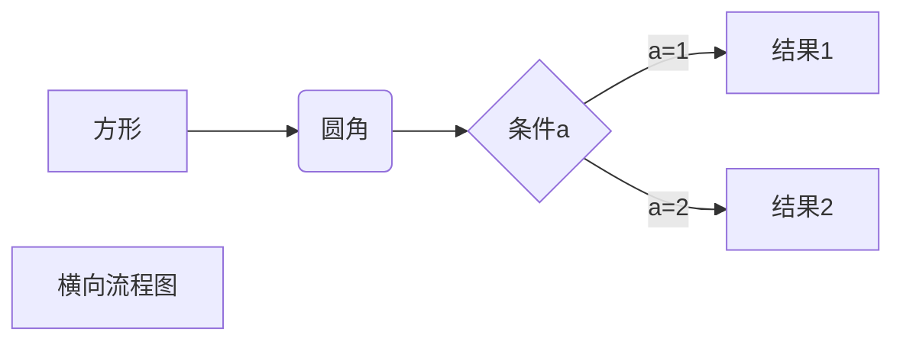
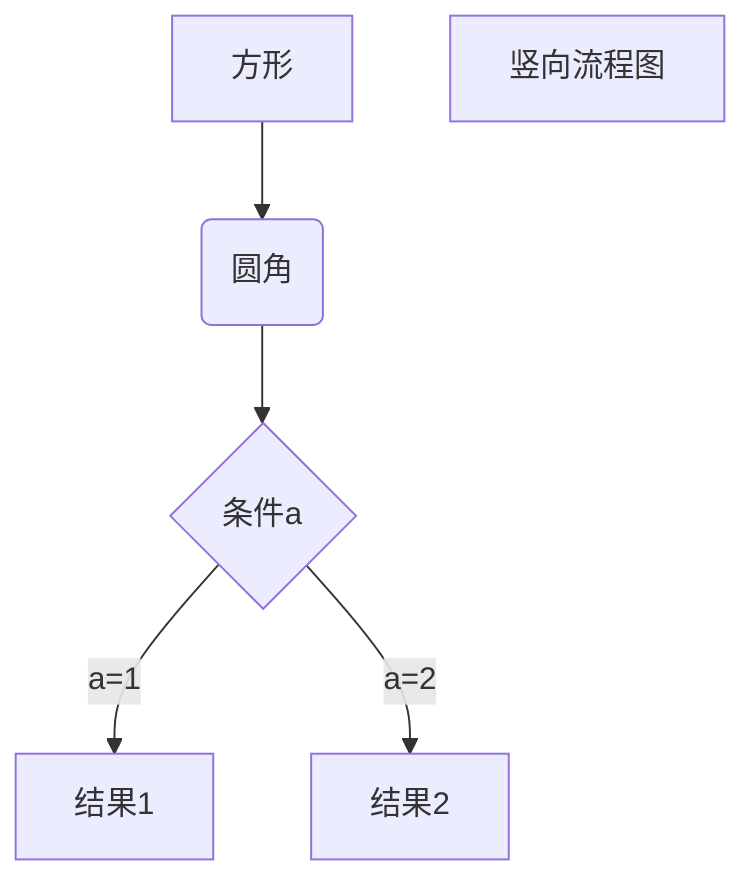
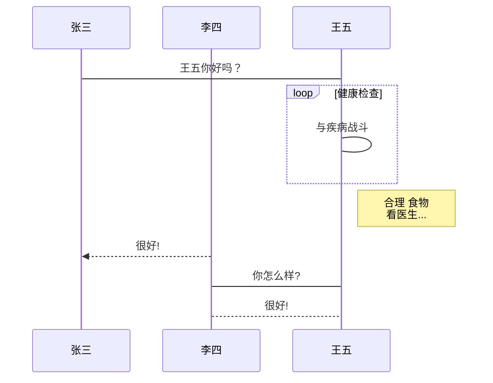
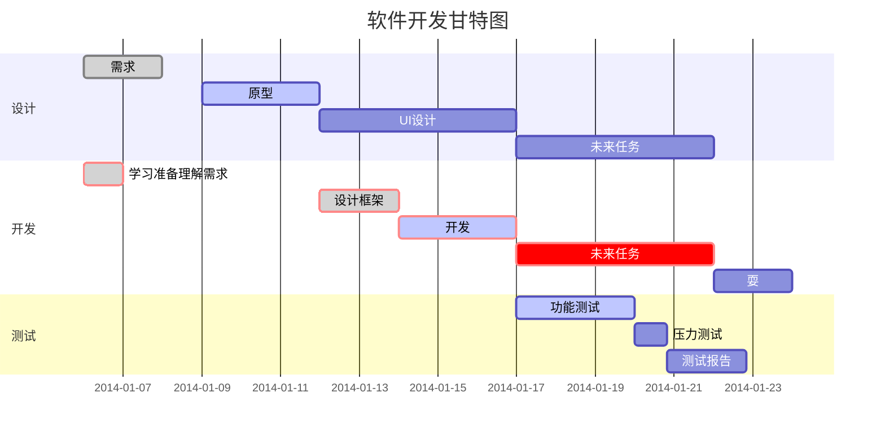

# 一、标题

在想要设置为标题的文字前面加#来表示
一个#是一级标题，二个#是二级标题，以此类推。支持六级标题。

```markdown
# 一级标题
## 二级标题
...
```

# 二、字体

- ##### 加粗

  > ##### 要加粗的文字左右分别用两个*号包起来 
  >
  > ```markdown
  >   **加粗字体测试**
  > ```
  >
  > **加粗字体测试**

- ##### 斜体

  > 要倾斜的文字左右分别用一个*号包起来   
  >
  > ~~~markdown
  > *斜体字体测试*
  > ~~~
  >
  > *斜体字体测试*

- ##### 斜体加粗

  > 要倾斜和加粗的文字左右分别用三个\*号包起来 
  >
  > ~~~markdo
  > ***斜体加粗字体测试***
  > ~~~
  >
  > ***斜体加粗字体测试***

- ##### 删除线

  > 要加删除线的文字左右分别用两个~\~号包起来
  >
  > ~~~markdown
  > ~~删除线测试~~
  > ~~~

- ##### 下划线

  >
  >
  >下划线可以通过 HTML 的 **<u>** 标签来实现：
  >
  >~~~markdown
  ><u>带下划线文本</u>
  >~~~
  >
  ><u>带下划线文本</u>

- ##### 脚注

  > ~~~markdown
  > [^要注明的文本]
  > ~~~
  >
  > 文字[^脚注]代码标记：代码之间分别用一个反引号包起来
  >
  > 

- 重点标记

  > ```markdown
  > `标记`
  > ```
  >
  > 内容`标记`内容

# 三、引用(区块)

在引用的文字前加>即可。引用也可以嵌套，如加两个>>三个>>>n个...

~~~markdown
> 引用
>> 引用
>>> 引用
在其内部可以使用markdown语法
~~~

> 引用
> > 引用
> >
> > > 引用
> > >
> > > **markdown语法**

# 四、分割线

三个或者三个以上的 - 或者 * 都可以。

```undefined
---
----
***
*****
```

---

***

# 五、图片

需要使用在线的地址，否则其他地方打不开

```markdown


图片alt就是显示在图片下面的文字，相当于对图片内容的解释。
图片title是图片的标题，当鼠标移到图片上时显示的内容。title可加可不加
```


# 六、超链接

```markdown
[超链接名](超链接地址 "超链接title")
title可加可不加
```

[百度](http://baidu.com "百度超链接")

# 七、列表

- ##### 无序列表

  >无序列表用 - + * 任何一种都可以
  >
  >```markdown
  >- 列表内容
  >+ 列表内容
  >* 列表内容
  >```
  >
  >- 列表内容
  >- 列表内容
  >- 列表内容

- ##### 有序列表

  >~~~markdown
  >1. 列表内容
  >2. 列表内容
  >3. 列表内容
  >~~~
  >
  >1. 列表内容
  >2. 列表内容
  >3. 列表内容

- ##### 列表嵌套

  > 上一级和下一级之间敲三个空格即可
  >
  > - 一级无序
  >   - 二级无序
  >   - 二级无序
  >
  > 1. 一级有序
  >    1. 二级有序
  >    2. 二级有序

# 八、表格

```ruby
表头|表头|表头
---|:--:|---:
内容|内容|内容
内容|内容|内容

第二行分割表头和内容。
- 有一个就行，为了对齐，多加了几个
文字默认居左
-两边加：表示文字居中
-右边加：表示文字居右
注：原生的语法两边都要用 | 包起来。此处省略
```

| 表头 | 表头 | 表头 |
| ---- | :--: | ---: |
| 内容 | 内容 | 内容 |
| 内容 | 内容 | 内容 |

# 九、代码块

代码之间分别用三个反引号包起来，且两边的反引号单独占一行

~~~markdown
```
  代码...
  代码...
  代码...
```
~~~

# 十、流程图

**1、横向流程图源码格式：**

```
​```mermaid
graph LR
A[方形] -->B(圆角)
    B --> C{条件a}
    C -->|a=1| D[结果1]
    C -->|a=2| E[结果2]
    F[横向流程图]
​```
```



**2、竖向流程图源码格式：**

```
​```mermaid
graph TD
A[方形] --> B(圆角)
    B --> C{条件a}
    C --> |a=1| D[结果1]
    C --> |a=2| E[结果2]
    F[竖向流程图]
​```
```



**3、标准流程图源码格式：**

```
​```flow
st=>start: 开始框
op=>operation: 处理框
cond=>condition: 判断框(是或否?)
sub1=>subroutine: 子流程
io=>inputoutput: 输入输出框
e=>end: 结束框
st->op->cond
cond(yes)->io->e
cond(no)->sub1(right)->op
​```
```

```flow
st=>start: 开始框
op=>operation: 处理框
cond=>condition: 判断框(是或否?)
sub1=>subroutine: 子流程
io=>inputoutput: 输入输出框
e=>end: 结束框
st->op->cond
cond(yes)->io->e
cond(no)->sub1(right)->op
```

**4、标准流程图源码格式（横向）：**

```
​```flow
st=>start: 开始框
op=>operation: 处理框
cond=>condition: 判断框(是或否?)
sub1=>subroutine: 子流程
io=>inputoutput: 输入输出框
e=>end: 结束框
st(right)->op(right)->cond
cond(yes)->io(bottom)->e
cond(no)->sub1(right)->op
​```
```

```flow
st=>start: 开始框
op=>operation: 处理框
cond=>condition: 判断框(是或否?)
sub1=>subroutine: 子流程
io=>inputoutput: 输入输出框
e=>end: 结束框
st(right)->op(right)->cond
cond(yes)->io(bottom)->e
cond(no)->sub1(right)->op
```

**5、UML时序图源码样例：**

```
​```sequence
对象A->对象B: 对象B你好吗?（请求）
Note right of 对象B: 对象B的描述
Note left of 对象A: 对象A的描述(提示)
对象B-->对象A: 我很好(响应)
对象A->对象B: 你真的好吗？
​```
```

```sequence
对象A->对象B: 对象B你好吗?（请求）
Note right of 对象B: 对象B的描述
Note left of 对象A: 对象A的描述(提示)
对象B-->对象A: 我很好(响应)
对象A->对象B: 你真的好吗？
```

**6、UML时序图源码复杂样例：**

```
​```sequence
Title: 标题：复杂使用
对象A->对象B: 对象B你好吗?（请求）
Note right of 对象B: 对象B的描述
Note left of 对象A: 对象A的描述(提示)
对象B-->对象A: 我很好(响应)
对象B->小三: 你好吗
小三-->>对象A: 对象B找我了
对象A->对象B: 你真的好吗？
Note over 小三,对象B: 我们是朋友
participant C
Note right of C: 没人陪我玩
​```
```

```sequence
Title: 标题：复杂使用
对象A->对象B: 对象B你好吗?（请求）
Note right of 对象B: 对象B的描述
Note left of 对象A: 对象A的描述(提示)
对象B-->对象A: 我很好(响应)
对象B->小三: 你好吗
小三-->>对象A: 对象B找我了
对象A->对象B: 你真的好吗？
Note over 小三,对象B: 我们是朋友
participant C
Note right of C: 没人陪我玩
```

**7、UML标准时序图样例：**

```
​```mermaid
%% 时序图例子,-> 直线，-->虚线，->>实线箭头
  sequenceDiagram
    participant 张三
    participant 李四
    张三->王五: 王五你好吗？
    loop 健康检查
        王五->王五: 与疾病战斗
    end
    Note right of 王五: 合理 食物 <br/>看医生...
    李四-->>张三: 很好!
    王五->李四: 你怎么样?
    李四-->王五: 很好!
​```
```



**8、甘特图样例：**

```
​```mermaid
%% 语法示例
        gantt
        dateFormat  YYYY-MM-DD
        title 软件开发甘特图
        section 设计
        需求                      :done,    des1, 2014-01-06,2014-01-08
        原型                      :active,  des2, 2014-01-09, 3d
        UI设计                     :         des3, after des2, 5d
    未来任务                     :         des4, after des3, 5d
        section 开发
        学习准备理解需求                      :crit, done, 2014-01-06,24h
        设计框架                             :crit, done, after des2, 2d
        开发                                 :crit, active, 3d
        未来任务                              :crit, 5d
        耍                                   :2d
        section 测试
        功能测试                              :active, a1, after des3, 3d
        压力测试                               :after a1  , 20h
        测试报告                               : 48h
​```
```



# 十一、公式

两个美元符 $$ 包裹 TeX 或 LaTeX 格式的数学公式

```
$$
\mathbf{V}_1 \times \mathbf{V}_2 =  \begin{vmatrix} 
\mathbf{i} & \mathbf{j} & \mathbf{k} \\
\frac{\partial X}{\partial u} &  \frac{\partial Y}{\partial u} & 0 \\
\frac{\partial X}{\partial v} &  \frac{\partial Y}{\partial v} & 0 \\
\end{vmatrix}
${$tep1}{\style{visibility:hidden}{(x+1)(x+1)}}
$$
```

$$
\mathbf{V}_1 \times \mathbf{V}_2 =  \begin{vmatrix} 
\mathbf{i} & \mathbf{j} & \mathbf{k} \\
\frac{\partial X}{\partial u} &  \frac{\partial Y}{\partial u} & 0 \\
\frac{\partial X}{\partial v} &  \frac{\partial Y}{\partial v} & 0 \\
\end{vmatrix}
${$tep1}{\style{visibility:hidden}{(x+1)(x+1)}}
$$

